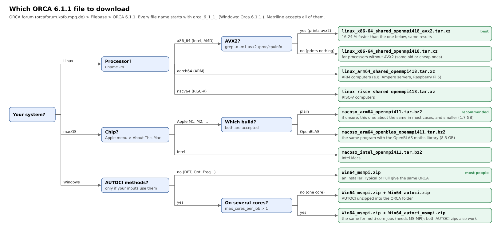

# Installing Matriline

Matriline has three programs. Each is a single static binary with no runtime dependencies:

| program | who runs it | what it does |
|---|---|---|
| `matriline-server` | the person who owns the calculations | keeps the queue (`input/`), receives and verifies results (`output/`), hands out keys |
| `matriline-client` | every computer that lends CPU (the server's own computer can too) | receives tasks, runs ORCA in a sandbox, returns signed results |
| `matriline-relay` | optional, on a machine with a public IP | lets server and clients meet when neither can open a port |

Tested on Linux x86-64: CachyOS/Arch, Ubuntu 26.04, AlmaLinux 10, Void and Debian 13, and
on Windows 10 and 11 (client, with a sandbox; server on Windows 11), and on macOS 14
(client, Apple Silicon and Intel under Rosetta 2, with a sandbox; tested in a VM).

## 1. Build

Release binaries are not published yet: you build the three programs from the source code,
in two steps.

### Step 1: install Git and Go (version 1.27 or newer)

Two free tools: **Git** downloads the code, **Go** compiles it. Check what you have with
`git --version` and `go version`; skip what is already installed (Go must say `go1.27` or
higher).

- **Linux:**
  - Arch, CachyOS: `sudo pacman -S git go`
  - Ubuntu, Debian: `sudo apt install git golang`
  - Fedora, AlmaLinux: `sudo dnf install git golang`

  If `go version` then shows a version older than 1.27, install Go from
  https://go.dev/dl/ instead (the `linux-amd64.tar.gz`; https://go.dev/doc/install shows the
  three commands).
- **macOS:**
  1. Git: open Terminal (Applications > Utilities) and run `xcode-select --install`; click
     *Install* in the window that appears (Apple's command line tools, which include git; a
     few minutes).
  2. Go: from https://go.dev/dl/ download the `.pkg` marked *Apple macOS (ARM64)* on an
     Apple Silicon Mac (M1, M2, ...) or *Apple macOS (x86-64)* on an Intel Mac (Apple menu >
     About This Mac says which), open it and follow the steps. (With Homebrew:
     `brew install go`.)
  3. Close Terminal and open it again, so it finds both.
- **Windows:**
  1. Git: from https://git-scm.com/download/win, the installer; the default options are fine.
  2. Go: from https://go.dev/dl/, the `.msi` marked *Microsoft Windows (x86-64)*; open it and
     follow the steps.
  3. Open a new PowerShell, so it finds both.

### Step 2: download and build Matriline

- **Linux and macOS**, in a terminal:

      git clone https://github.com/agaloya/matriline.git
      matriline/build.sh            # builds the three programs into ~/.local/bin

  `build.sh` says if `~/.local/bin` is not in your PATH (macOS never has it). Add it once,
  then open a new terminal:

      echo 'export PATH="$HOME/.local/bin:$PATH"' >> ~/.zshrc     # macOS (zsh)
      echo 'export PATH="$HOME/.local/bin:$PATH"' >> ~/.bashrc    # Linux with bash

  (By hand instead: `cd matriline/src`, then
  `go build -o ~/.local/bin/matriline-client ./client`, and the same for server and relay.)
- **Windows**: open PowerShell **as administrator** (Start menu, type PowerShell,
  right-click > *Run as administrator*):

      cd $HOME
      git clone https://github.com/agaloya/matriline.git
      powershell -ExecutionPolicy Bypass -File matriline\build.ps1

  The programs go to `C:\Program Files\Matriline`, and that folder is added to the system
  PATH: open a new PowerShell to use `matriline-server`, `matriline-client` and
  `matriline-relay` by name. (Without administrator rights, choose a folder of yours:
  `... build.ps1 -Out $HOME\Matriline`. In Program Files a client cannot replace its own
  program, so the optional automatic updates, section 6, report that computer as unable to
  update: update it by hand.)

Check: `matriline-client version` prints the version (`commit dev` for a build from source;
the released programs name their commit).

Two options, explained at the end of this file (section 9):
a build **without security**, for your own trusted machines only, and **checking that a
program someone gave you** was built from this code.

## 2. ORCA

Every client needs its own ORCA installation, of the version the server asks for
(`[orca] version` in server.conf, default 6.1.1). ORCA is free for academic use but cannot be
redistributed, so each user downloads it from https://orcaforum.kofo.mpg.de and accepts the
license. **Using Matriline is using ORCA: the ORCA EULA applies to the admin and to every
helper** (academic or private use only; calculations for others only when everyone involved
holds an ORCA license; ORCA cited in publications). Summary and details:
[docs/ORCA_LICENSE.md](docs/ORCA_LICENSE.md).

### Already installed?

`matriline-client doctor` lists the ORCA installations it finds (also before the client is
set up in section 4). To see where it is:
`type -a orca` and `ls -d /opt/orca* ~/orca*` (Linux, macOS) or `where.exe orca`
(Windows; else look in `C:\` and `C:\Program Files`). `type -a` lists every program called
`orca` in your PATH, in the order they are used: on Linux, `/usr/bin/orca` is usually
GNOME's screen reader, not the chemistry program. Its folder holds the
program `orca` (`orca.exe`). Matriline needs version 6.1.1 unless your admin says otherwise.

### Which file to download

Log in at the [ORCA forum](https://orcaforum.kofo.mpg.de) (free registration), open
*Filebase* > ORCA 6.1.1, and pick by this chart:

(Click the chart to see it full size.) Every name starts with `orca_6_1_1_` (Windows:
`Orca.6.1.1.`), and Matriline knows all of them, so any server accepts whichever you take.
On Linux, `uname -m` says the processor and `grep -o -m1 avx2 /proc/cpuinfo` prints `avx2`
if it has AVX2; on a Mac, Apple menu > About This Mac says *Chip Apple M...* or
*Processor Intel*. The AVX2 build was measured 16-24 % faster than the generic one with the
same energies. On an Apple Silicon Mac, if you are unsure, take the plain build: it does
about the same in most cases and is 5 times smaller than the OpenBLAS one. AUTOCI is only for ORCA's AUTOCI methods;
ordinary DFT, optimizations and frequencies do not use it.

Take an archive (`.tar.xz`, `.tar.bz2`) rather than an installer (`.run`): you just unpack
it, and you choose where. Windows has only the installer.

### Installing it

**Linux:** into `/opt/orca-6.1.1` (it unpacks to about 17 GB: check the free space first):

    cd /opt
    sudo tar -xf ~/Downloads/orca_6_1_1_linux_x86-64_shared_openmpi418_avx2.tar.xz   # your file
    sudo mv orca_6_1_1_linux_x86-64_shared_openmpi418_avx2 orca-6.1.1               # its folder

Without administrator rights, do the same in your home (`cd ~`, no `sudo`): the client finds
`~/orca*` too.

**macOS:** into a folder `orca` in your home (no administrator rights needed):

    mkdir -p ~/orca && cd ~/orca
    tar -xf ~/Downloads/orca_6_1_1_macosx_arm64_openmpi411.tar.bz2                  # your file
    xattr -dr com.apple.quarantine ~/orca                                            # see below

If for some reason you need ORCA's Intel build instead of the arm64 one on an Apple Silicon
Mac, you need Apple's Rosetta 2 (install it once with `softwareupdate --install-rosetta`);
calculations will then be slower.

**Windows:** unzip `Orca.6.1.1.Win64_msmpi.zip` (right-click > *Extract All*), double-click
`Orca6.1.1.Win64.exe` and install into `C:\ORCA_6.1.1` (*Typical* or *Full* give the same
ORCA; the client looks in `C:\ORCA*` and `C:\Program Files\ORCA*`). AUTOCI, only if you need
it: *Extract All* and, as the destination, choose `C:\ORCA_6.1.1` itself (Windows proposes
a new subfolder: remove that part), so its programs sit next to `orca.exe`. MS-MPI (Microsoft's MPI) is needed only for
multi-core jobs (section 4).

**With the installers instead** (`.run` on Linux and macOS), choose the folder yourself:
`sh orca_6_1_1_..._.run -- -p /opt/orca-6.1.1`. Left to themselves installers may pick another
place (on Windows too, unless you change it); `ls -d /opt/orca* ~/orca*` or
`where.exe orca` then shows where it went.

**Check it** with a 1-second job. Save this as `water.inp`:

    ! HF def2-SVP
    * xyz 0 1
    O 0 0 0
    H 0 0.757 0.587
    H 0 -0.757 0.587
    *

and run ORCA by its full path (`/opt/orca-6.1.1/orca water.inp`,
`~/orca/orca_6_1_1_macosx_arm64_openmpi411/orca water.inp`, `C:\ORCA_6.1.1\orca.exe water.inp`).
The end of the output says `ORCA TERMINATED NORMALLY`.

**Careful: `orca` is also the name of the screen reader** that people who cannot see use on
Linux (GNOME's Orca, `/usr/bin/orca`; some Linux distributions install it by default). Never
remove, rename or hide it: someone may depend on it to use the computer. Matriline does
not need ORCA in the PATH and never runs anything called `orca` by name, so it leaves the
screen reader alone. Only the steps below, for running ORCA yourself, could get in its way.

**To run ORCA yourself by a short name** (optional). First see what `orca` is now:
`type -a orca` (Linux, macOS) or `where.exe orca` (Windows).

- **Something is listed** (the screen reader, or another ORCA version): leave it as it is and
  give the chemistry ORCA another name, which hides nothing:

      echo "alias orca6='/opt/orca-6.1.1/orca'" >> ~/.bashrc     # Linux (bash); your folder

  (macOS: the same in `~/.zshrc`). Open a new terminal: `orca6 water.inp`.
- **Nothing is listed:** add ORCA's folder at the *end* of the PATH, so it can never hide
  another program:

      echo 'export PATH="$PATH:/opt/orca-6.1.1"' >> ~/.bashrc     # Linux (bash)
      echo 'export PATH="$PATH:$HOME/orca/orca_6_1_1_macosx_arm64_openmpi411"' >> ~/.zshrc   # macOS

  Open a new terminal and check with `type -a orca`.

ORCA's `.run` installer edits the PATH by itself. After using it, run `type -a orca`
again: if the screen reader is no longer the first one listed, open `~/.bashrc` (or
`~/.zshrc`), find the line the installer added (it names the ORCA folder) and change it to
the alias above. One more reason to prefer the archive, which changes nothing. On Windows
the ORCA installer adds its folder to the PATH; Windows' screen readers (Narrator, NVDA,
JAWS) have other names, and so does VoiceOver on macOS. For multi-core runs ORCA wants to be
started by its full path anyway. If ORCA itself does not install or
run, see its manual's [installation chapter](https://www.faccts.de/docs/orca/6.1/manual/contents/quickstartguide/installation.html)
or ask in the [ORCA forum](https://orcaforum.kofo.mpg.de).

**macOS: "cannot be opened because Apple cannot check it for malicious software".** Files
downloaded with a browser are marked as quarantined, and ORCA is not signed by Apple, so
Gatekeeper stops each of its programs. Remove the mark once from the whole ORCA folder:

    xattr -dr com.apple.quarantine ~/orca     # the folder you unpacked ORCA into

(One program at a time also works: System Settings > Privacy & Security > "Open Anyway",
but ORCA has dozens. Under Matriline nobody sees the dialog: a quarantined ORCA just
hangs, which is why `doctor` checks for the mark and prints this command.) Matriline itself
needs nothing of this when you build it (section 1): only downloaded files are marked.

The client finds ORCA by itself in the folders above; another place goes in `[orca] paths`
in client.conf. Keep older versions in their own folders (e.g. `/opt/orca-6.0.1`) instead of
overwriting them.

**Another ORCA version** (not 6.1.1): the fingerprints Matriline knows are in
[`src/server/fingerprints/`](src/server/fingerprints/) (one file per official build). If
your version is not there, the admin sets `[orca] version` and accepts each build by its
fingerprint: on a computer with that build, `matriline-client fingerprint <ORCA folder> >
build.json`, and the admin lists the file in `orca.accepted_fingerprints`.

## 3. Server

This section sets up the server: the project folder and its configuration (`server.conf`),
opening its network port, starting it, and leaving it running by itself as a **service**.
The service matters: helpers can only receive work and send results back while the server
runs. As a service it starts with the computer (or when you log in), restarts by itself
after a crash, a power cut or an update, and needs no terminal left open.

### 3.1 Create the project

    matriline-server init /path/to/project/directory --language en
    # --language: en, es, fr, pt or ar (ar: machine translation, not reviewed); it sets the
    # language of server.conf's explanations and of the menus. Without it, this computer's.
    cd /path/to/project/directory && nano server.conf      # every option is explained there
    # any text editor works: micro, vim, gedit...; on Windows: notepad server.conf

Replace `/path/to/project/directory` with your project's folder (`init` refuses the example
as it is). That folder must **already exist and be empty**: it becomes the project (queue,
results, keys), so make a new one for each project, e.g. `mkdir -p ~/matriline/myproject`
(Windows: `mkdir $HOME\matriline\myproject`). `init` never overwrites a folder that already
has a `server.conf`.

`init` also remembers the project, so later commands work **from any folder**: with one
project on this computer they use it; with several they ask which one (in a script, add
`-c /path/to/project/directory/server.conf`). Inside a project folder, that project is used.
The list is a text file in `~/.config/matriline` (Linux), `~/Library/Application
Support/matriline` (macOS) or `%AppData%\matriline` (Windows); deleted projects drop off it.

### 3.2 Open the port

> **Before any helper can connect: open the server's port (TCP 44100 by default).**
> Helpers only dial out, but the server must be reachable. Two places can block it:
>
> 1. **This computer's firewall.** Allow incoming TCP on the port:
>    - Ubuntu, Debian (ufw): `sudo ufw allow 44100/tcp`
>    - Fedora, AlmaLinux, openSUSE (firewalld):
>      `sudo firewall-cmd --permanent --add-port=44100/tcp && sudo firewall-cmd --reload`
>    - Windows: see 3.6 (two `netsh` commands; `doctor` prints them).
>    - macOS (a server or relay on a Mac is not tested yet): its firewall works by program,
>      not by port. If it is on (System Settings > Network > Firewall), allow the program
>      once in Terminal, and again after each rebuild:
>      `sudo /usr/libexec/ApplicationFirewall/socketfilterfw --add ~/.local/bin/matriline-server`
>      then `sudo /usr/libexec/ApplicationFirewall/socketfilterfw --unblockapp ~/.local/bin/matriline-server`
>      (or Firewall > Options > + > that program > *Allow incoming connections*;
>      `matriline-relay` the same way on a relay).
> 2. **The router, at home or in a small office: port forwarding.** In the router's web
>    page (often http://192.168.1.1 or http://192.168.0.1; the address and password are
>    usually on a label on the router), forward TCP port 44100 to this computer's local
>    address (`ip -4 addr` on Linux, `ipconfig` on Windows). On a network you do not
>    manage (at work, at an institution), its administrators do this: ask them to open the
>    port to this computer.
>
> Then put the public address in `[network] advertise` (3.3), and check it from a
> helper on *another* network: `matriline-client doctor` says whether the server answers.
> If no port can be opened at all, use a relay (section 5).

### 3.3 Settings to review first

All in `server.conf`; every option is explained in the file itself.

- `[network] advertise`: the address helpers dial, `your.public.ip:44100`. Fill it in
  before issuing credentials (3.9). `listen` (default `44100`) is the port; open it as in 3.2.
  Without any reachable port, use a relay (`connection = relay`, section 5).
- `[network] enrollment`. `issued` (default): you create one credential file per helper.
  `register`: helpers create their own key with a one-time token and you approve them.
- `[tasks] max_job_time` (default `1d`): the longest one calculation may run on one
  computer; then it goes to `errors/` with its orbitals, and `retry` continues from them.
  `scheduler = order` (default) or `learned` (long jobs to fast clients).
- `[orca] version`: `init` sets the version it finds here (6.1.1 by default). The server
  accepts every official build of that version by itself, so it needs no ORCA of its own.
- `[verify]`: the cost/trust trade-off of every integrity layer is explained in place.
  Measured in the lab (docs/SECURITY_TESTS.md): the SCF and gradient checks catch forged
  energies at a small fraction of the cost of a replica.
- `[general] language`: `en`, `es`, `fr`, `pt` or `ar` for the menus, help, web page and
  alerts (Arabic is a machine translation, not yet reviewed). Without `--language`, `init`
  takes this computer's language (LANGUAGE, then LANG or the Windows/macOS display
  language, then the keyboards: English first, then Spanish, French, Portuguese, Arabic),
  else English. Logs and error messages stay in English.

### 3.4 Start it and check it

    matriline-server run          # in this terminal; Ctrl+C stops it
    matriline-server doctor       # configuration, ORCA, disk, port, ledger

Only one server can run per project folder. For a second project, `init` another folder
and use another port.

### 3.5 Leave it running as a service (recommended)

Stop the `run` of 3.4 first (Ctrl+C). Then, in the project folder, for your system:

**Linux** (a systemd user service):

    matriline-server service install    # 'service remove' undoes it
    loginctl enable-linger "$USER"      # once: it keeps running while you are logged out
                                        # and starts when the computer starts

**Windows** (a scheduled task without a window), in an **administrator** PowerShell:

    matriline-server service install    # starts with the computer, with nobody logged in

(Without administrator rights it only starts when you log in.)

**macOS** (a launchd agent in `~/Library/LaunchAgents`; a server on a Mac is not tested yet):

    matriline-server service install    # runs while you are logged in

and turn on automatic login (System Settings > Users & Groups) so it is back after a
restart. Its output goes to `state/service.log`.

Each project gets its own service (`matriline-server-<8 hex digits>`), so several servers
(or clients) on one computer do not replace each other. `matriline-server status` works
the same with the service.

### 3.6 Windows: the firewall

It runs as on Linux (PowerShell, `matriline-server.exe`). Windows
Firewall blocks incoming connections to a new program, and when nobody answers its prompt
(a scheduled task, a dismissed window) it adds *Block* rules named `matriline-server`,
which win over any *Allow* rule. An administrator runs once (the port is yours):

    netsh advfirewall firewall delete rule name="matriline-server" dir=in
    netsh advfirewall firewall add rule name="Matriline server port 44100" dir=in action=allow protocol=TCP localport=44100

The server prints this at start-up and in `doctor`. Tested on Windows 11 with Linux and
Windows clients (2026-10-05).

### 3.7 Daily use

All commands work while the server runs.

    matriline-server add ~/molecules/batch1         # copy inputs into input/
    matriline-server status                         # queue, clients, coloured bar
    matriline-server status input/batch1            # the same for one sub-directory
    matriline-server review                         # results in weird/ and why
    matriline-server accept|reject weird/<path>     # your decision on a weird result (accept
                                                    # replaces the result in output/; the
                                                    # replaced one moves to outdated/)
    matriline-server redo output/<path>             # compute an accepted task again
                                                    # (the old result moves to outdated/)
    matriline-server events [n]                     # the short log: admin actions, what the
                                                    # system noticed (state/events.log)
    matriline-server check                          # every task in one place, none lost
                                                    # (also hourly; see state/events.log,
                                                    # the short log of admin actions and
                                                    # of what the system noticed)
    matriline-server clean --dry-run '*.densities'  # free disk (recorded in the ledger)
    matriline-server clients disable <name> [why]   # switch a helper off remotely (it
                                                    # returns its tasks, deletes its job
                                                    # data and stays off; also if offline:
                                                    # at its next connection). --wipe also
                                                    # deletes its key and credential
    matriline-server clients enable <name>          # undo it (then on that computer:
                                                    # matriline-client enable)
    matriline-server verify                         # ledger + every stored file intact?
    matriline-server help                           # everything else
    matriline-server console                        # the same commands from menus
    matriline-server web                            # the same commands as a web page

Results arrive in `output/<same sub-directory>/<input name>/`. Inputs move to `completed/`
when their result is accepted.

### 3.8 The web page

`web` listens on this computer only and prints a link with a secret token, valid 12 hours;
open it in a browser on the same computer. On Linux it picks a random 127.x.y.z address
(browser cookies are shared by all ports of one address, and other local users may run
web pages on 127.0.0.1). From another computer, give it an address and use an SSH tunnel:
`matriline-server web 127.0.0.1:8484`, then `ssh -L 8484:127.0.0.1:8484 <server>` and open
the printed link. `config edit` is a
text box there (checked before saving; never overwrites a change made meanwhile);
editing inputs (`edit`), `restore` and `stop` stay in the terminal.

### 3.9 Letting a helper in

**With a kit (easiest): one file per helper.** The server makes it, on Linux, macOS or
Windows alike:

    matriline-server kit claudia ~/kits
    # options: --language es  --settings my-client.conf  --uses 5  --only unix|windows

It issues a one-time credential and writes two files into `~/kits` (default settings: one
core; change them with `--settings` or at the top of each file), each with everything inside
(the credential, the client program and your settings):

- `claudia-setup.sh` for Linux and macOS (it holds the program for every processor),
- `claudia-setup.bat` for Windows.

The clients come from the **signed official release of the server's own version**,
downloaded and checked like an update (`[update] url`). Before a release is published, or
without internet, build them once with `tools/release.sh dist` in the source folder and add
`--clients dist`.

Send the file for the helper's system **privately**: whoever uses the credential first gets
in, and it is used up on the first connection. `--settings` takes client settings in
client.conf format (cores, memory_per_core, windows, pause_on_battery, keep_awake,
end_date...). The helper runs it (4.0): the computer is set up and the service installed.
Tested on Linux and on Windows 10 and 11.

**By hand.** For each computer that will lend CPU:

    matriline-server keys issue claudia claudia.cred     # a one-time ticket, valid 48 h

Give that person `claudia.cred` privately (not in a public chat: whoever uses the ticket
first gets in), and the `matriline-client` program for their system, or let them build it
(section 1). For another system, in `src`: `GOOS=windows go build -o
matriline-client.exe ./client` (or `GOOS=darwin GOARCH=arm64`). Then they follow section 4.

## 4. Client (a computer that lends CPU)

This section turns a computer into a helper: it receives calculations from the server, runs
ORCA in an isolated sandbox and sends the results back. The client should run as a
**service** (4.5): then it works in the background without a terminal, starts by itself
with the computer (or when you log in), and after a crash or a power cut it continues the
calculations where they were. You stay in control: you decide how much of the computer it
uses (4.3), you can pause it or switch it off whenever you want (4.6), and the server's admin
can also switch it off remotely when your computer is no longer needed.

### 4.0 The easy way: a file from the admin

If the admin sent you a setup file, install ORCA first (section 2), then:

- **Linux:** open a terminal where the file is (its real name has your name or your
  computer's) and run:

      chmod +x claudia-setup.sh          # a downloaded file is not executable yet
      ./claudia-setup.sh                 # sets everything up and installs the service
      loginctl enable-linger "$USER"     # once: it keeps working while you are logged out
                                         # and starts with the computer

- **macOS:** the same in Terminal, without the last line (on a Mac it works while you are
  logged in; automatic login brings it back after a restart):

      chmod +x claudia-setup.sh
      ./claudia-setup.sh

  No `sudo` is needed: everything goes in your own folders and runs as your user.
- **Windows:** double-click `claudia-setup.bat`, or right-click it > *Run as administrator*
  (then it also works with nobody logged in). If Windows warns about an unknown program:
  *More info* > *Run anyway*.

It does all of 4.1-4.5 for you with the settings the admin chose: puts the program in place,
creates the working folder, checks ORCA and the connection, and installs the service. You can
delete the file afterwards, change the settings later (4.3) or stop it whenever you want
(4.6).

Without such a file, follow 4.1-4.5.

### 4.1 What you need

- The program `matriline-client` for your system (from the admin, or built as in section 1).
  Put it in `~/.local/bin` (Linux, macOS) or keep the Windows build in
  `C:\Program Files\Matriline`; if your terminal says "command not found", call it by its
  full path.
- The credential file the admin gave you (any name, e.g. `claudia.cred`): a one-time ticket,
  valid 48 hours by default.
- ORCA installed on this computer: section 2.

### 4.2 Create the client

Linux and macOS, in a terminal:

    matriline-client init ~/matriline/cli --credential /path/to/claudia.cred --language en
    # ~/matriline/cli: the client's working folder (settings, its key, the calculations in
    # progress); choose an empty folder on a disk with free space, and keep it there.

Windows, in PowerShell:

    matriline-client init $HOME\matriline\cli --credential C:\path\to\claudia.cred --language en

- Replace `/path/to/claudia.cred` with where the file really is. `init` copies it into the
  working folder (as `credential.conf`); on its first connection the client creates its own
  key there (`state/client.key`, which never leaves your computer) and the ticket is used
  up. So the original file can be deleted afterwards; what must stay in place is the
  **working folder**. To move it: `service remove`, move the folder, then `service install`
  from its new place.
- `--language`: `en`, `es`, `fr`, `pt` or `ar`, for `client.conf` and the messages (default:
  this computer's).
- `init` finds ORCA by itself; if not, it says so (then set `[orca] paths` in client.conf).
- The client's commands work from any folder: `init` remembers the working folder (with
  several on one computer they ask which one; in a script add `-c ~/matriline/cli/client.conf`).

### 4.3 Decide how much it works

The defaults lend most of the computer, so look at least at these in `client.conf` (every
option is explained in the file):

    cd ~/matriline/cli && nano client.conf     # or micro, vim...; Windows: notepad client.conf

| setting | default | what it changes |
|---|---|---|
| `cores` | all physical cores but one | how many calculations run at once; fewer leaves the computer more responsive |
| `memory_per_core` | 1 GiB | memory each calculation may use; the client lends fewer cores if RAM runs short |
| `windows` (under `[schedule]`) | always | hours it may work, e.g. nights and weekends only |
| `pause_on_battery` | yes | laptops: stop taking work on battery |
| `keep_awake` | yes | while it computes on mains power, the computer does not go to sleep by itself (the screen may still turn off; closing a laptop's lid still suspends it) |
| `cpu_temperature_limit` | off | no new work above that temperature (°C) |
| `disk_reserve` | 10 GiB (at most 20 % of the disk) | disk space always left free for you |
| `bandwidth_limit` | 10 Mbit/s | upload and download speed it may use |
| `end_date` | never | the day it stops by itself |

Settings the admin suggested arrive in the credential and are already written there; you may
change any of them. Changes apply when the client restarts.

### 4.4 Check it

    matriline-client doctor     # ORCA, the sandbox, the credential and whether the server answers

The first time it spends a minute or two fingerprinting ORCA's files. `doctor` should report
a sandbox: `landlock+userns+netns` on Linux, `appcontainer` on Windows, `sandbox-exec` on
macOS. ORCA then runs without network access and without access to anything outside its job
folder.

### 4.5 Leave it running as a service

In the working folder, for your system:

**Linux** (a systemd user service):

    matriline-client service install    # 'service remove' undoes it
    loginctl enable-linger "$USER"      # once: it keeps working while you are logged out
                                        # and starts when the computer starts

**Windows** (a scheduled task without a window), in an **administrator** PowerShell:

    matriline-client service install    # starts with the computer, with nobody logged in

(Without administrator rights it only starts when you log in.)

**macOS** (a launchd agent in `~/Library/LaunchAgents`):

    matriline-client service install    # works while you are logged in

and turn on automatic login (System Settings > Users & Groups) so it is back after a
restart.

Then `matriline-client status` says whether it is running, connected (and to which server),
and what it is computing. What it does is written to `state/client.log`.

(Only for a quick try in a terminal: `matriline-client run`; Ctrl+C stops it.)

### 4.6 Pause it, stop it, switch it off

    matriline-client pause 2h        # no new calculations for 2 hours (running ones finish)
    matriline-client pause --now     # until 'resume'; running calculations stop within seconds
                                     # and go back to the server (nothing lost: another
                                     # computer continues from their orbitals)
    matriline-client resume          # lend it again
    matriline-client service remove  # stop for good: it no longer starts by itself

To remove it completely, see section 8. The admin can also switch your client off from the
server (`clients disable`); it then gives its work back, deletes its job data and stays off.

### 4.7 Notes per system

- **Windows:** ORCA runs fully isolated (no network, only its job folder) after one step by an
  administrator, which `doctor` prints with the exact paths (two `icacls` commands); until
  then it runs at low integrity (it cannot write outside its job folder). Multi-core
  calculations (optional: `max_cores_per_job` above 1) need the Microsoft MPI runtime
  (`msmpisetup.exe`, https://github.com/microsoft/Microsoft-MPI, version 10); they can write
  only in their job folder but are not cut off from the network, unlike single-core ones.
- **macOS:** an ORCA unpacked from a downloaded archive is held by Gatekeeper (section 2;
  `doctor` prints the command for your folder). Calculations use one core each: multi-core
  jobs are not offered on macOS (docs/PORTING.md).
- **Linux:** multi-core calculations need OpenMPI 4.1 (`[orca] mpi_path`).

### 4.8 If something goes wrong

- The log `state/client.log` says what happened (`tail -f state/client.log`; Windows:
  `Get-Content state\client.log -Wait`).
- "cannot reach the Matriline server": the log explains what to check; the usual cause is a
  network that only allows web ports: ask the admin for an address on port 443 or for a relay.
- "already used or has expired": the ticket was used (by you before, or by someone else) or is
  older than 48 h: ask the admin for a new one.
- Only one client can run per working folder.

**Other ways to join** (when the admin chose them):

- **register mode:** the admin gives you a token and the server key, and you run
  `matriline-client join --server host:port --server-key <key> --token <token> --name <name>`
  in a folder made with `matriline-client init <folder>`; the admin then approves you
  (`matriline-server clients approve <id>`).
- **several computers of one admin:** `matriline-server keys issue lab lab.cred --uses 5` makes
  one ticket for five computers; each still creates its own key and gets its own name
  (lab-1, lab-2, ...), so each can be switched off alone. One key on two computers at once
  is detected and alerted (a copied working folder, a cloned virtual machine).

(Admins: `matriline-server keys issue <name> <file> --preset client-settings.conf` puts
suggested client settings, in client.conf format, into the credential. The client's own
files and its sandbox cannot be preset.)

## 5. Relay (optional: when the server cannot open any port)

A relay is a meeting point on a computer with a public IP address (a small cloud server is
enough). The server and the helpers both connect *out* to it, so nobody needs port
forwarding. It only passes along the encrypted stream: it cannot read inputs or results
(with the default `security = tls`), and it keeps nothing.

On the relay computer (build it as in section 1; it is the third program):

    matriline-relay -listen :44100                  # foreground; Ctrl+C stops it
    matriline-relay -listen :44100 -allow <server id>   # only your server may register

Open that TCP port in its firewall (as in 3.2). Port 443 helps helpers on networks
that allow only web ports; on Linux a normal user may use it after
`sudo setcap cap_net_bind_service=+ep $(command -v matriline-relay)`. The server id is the
first line of `matriline-server status` (`ml1-...`).

**Leave it running as a service (Linux).** Save this as
`~/.config/systemd/user/matriline-relay.service`:

    [Unit]
    Description=Matriline relay
    After=network-online.target

    [Service]
    ExecStart=%h/.local/bin/matriline-relay -listen :44100
    Restart=on-failure

    [Install]
    WantedBy=default.target

then:

    systemctl --user enable --now matriline-relay    # starts it now and at every start
    loginctl enable-linger "$USER"                   # once: it keeps running while you are
                                                     # logged out and starts with the computer

On the server, in `server.conf` under `[network]`, then restart the server:

    connection = relay
    relay_address = relay.example.org:44100     # the relay's public address and port

`matriline-server status` and the relay's own output show the server registered. Credentials
issued from then on carry the relay's address, so helpers set up as in section 4 with
nothing extra. (In `register` mode, helpers add `--relay relay.example.org:44100` to
`join`.) Tested with servers on Linux and Windows 11 and helpers on Linux, Windows 10 and
11 and macOS.

## 6. Updating

By hand: get the new code and build again, in the folder you cloned in section 1 (no need
to delete it):

    cd matriline && git pull && ./build.sh                  # Linux, macOS
    cd matriline; git pull; powershell -ExecutionPolicy Bypass -File build.ps1   # Windows, as administrator

(or download a release and check it, section 9), then restart the services. Running
calculations survive a client restart: they resume from their last checkpoint.

To delete that folder: `rm -rf matriline` (Windows: `Remove-Item -Recurse -Force matriline`).
A plain `rm -r` asks about "write-protected" files: they are git's own files in the hidden
`.git` folder, which git keeps read-only on purpose; deleting them is fine.

Automatically (**experimental**, off by default; `[update] mode` in server.conf). Not
recommended for a project in progress: there is no migration of the configuration or of
the folders yet, so a version that changed their format could disorganize the project.

- `alert`: once a month the server looks for a new release and tells you (alerts);
  `matriline-server update status` shows it, `matriline-server update apply` installs it.
- `auto`: the same, and it installs it by itself.

Installing happens only if every client can update (`update status` says who cannot, and
why). Clients go first, each one when its running jobs are done, then the server, which
restarts. Only releases signed with the Matriline maintainer's key, which is built into
the programs, are installed: not even someone who controls the release page or your
server can make a computer install anything else. The previous program stays next to the
new one as `<program>.previous` (rename it back to undo). Before it replaces anything,
the new program is run once and must report the expected version; one that does not run
on a computer is never installed there; the update waits for that computer and you are
told (`update apply --force` goes on without it). Each computer downloads from its own
`update_url` (GitHub by default), never from an address the server chooses, and a signed
release can only be installed for 120 days. `update apply --force` installs even if some
clients cannot update (they keep the old version). A helper who does not want
updates sets `updates = false` under `[security]` in client.conf (the server then reports
that it cannot update everyone).

Maintainer: `tools/release.sh dist`, then `cd src && go run ./relsign sign <key> ../dist`
and `gh release create v<version> dist/*` (the key is created once with
`go run ./relsign keygen <file>` and its public half goes into
`src/common/release/keys.go`; keep the private file off GitHub).

## 7. Scripts and automation

No network API is needed: everything is on the server's own computer.

- **Folders:** any program that writes an `.inp` file into `input/` (or a sub-folder)
  queues a calculation; results appear in `output/`, `weird/` or `errors/`.
- **Commands with `--json`:** `status`, `live`, `clients`, `review`, `history <task>` and
  `events [n]` print JSON instead of text, e.g. from Python:
  `json.loads(subprocess.check_output(["matriline-server", "-c", conf, "status", "--json"]))`.
  Every other command works from scripts as on the command line.
- **Alerts** reach you by e-mail, by Telegram (a bot of yours; send it /start first) or
  both: fill in `[alerts]` at the top of server.conf (step by step at the end of the
  file), then `matriline-server test-alert`.
- **Hooks** (`[hooks]` in server.conf): a program run for each result that arrives in, or
  moves to, `output/`, `weird/` or `errors/` (`result <task> <output|weird|errors>
  <folder>`, also in the environment), and one when the queue empties (`done
  
`). With them, copying results to a cloud folder, uploading them by FTP or
  writing the next input of a chain (an opt followed by a freq) is a few lines of script.

## 8. Uninstalling

Results are in the server's `output/`; back them up first (`matriline-server backup
<dir>`). Then, on each computer:

    matriline-client service remove      # in the client's directory (or -c .../client.conf)
    matriline-server service remove      # in the server's directory
    # stop whatever still runs in a terminal (Ctrl+C), and the relay's service if you made one:
    # systemctl --user disable --now matriline-relay

and delete the source folder of section 1 (`rm -rf matriline`; Windows: `Remove-Item
-Recurse -Force matriline`), the programs (`~/.local/bin/matriline-*`; Windows:
`C:\Program Files\Matriline`) and the working directories (the project folder,
`~/matriline/cli`). On Windows also remove `C:\Program Files\Matriline` from the system
PATH (Settings > System > About > Advanced system settings > Environment Variables).
Nothing else is installed: no registry keys, no other system files. ORCA is separate: keep
it or remove it as its own documentation says.

## 9. More about building

### Build without security (only for your own trusted machines)

    matriline/build.sh --nosecurity                         # Linux, macOS
    powershell -ExecutionPolicy Bypass -File matriline\build.ps1 -NoSecurity   # Windows

These binaries skip every result check on the server and run ORCA without the sandbox and
the process audit on the client (less overhead, nothing to configure). `version` says
"no-security build". A normal server gives such clients no task unless
`network.accept_nosecurity_clients = true`. Release builds never are.

### Checking a program someone gave you

Release builds are reproducible: the same commit and target give the same bytes on any
build host, so you never have to trust whoever sent a binary. `tools/release.sh` pins the
official Go toolchain (the `go` command downloads it), strips build paths and ids, and
stamps the commit; the SHA-256 of every target is published in `docs/releases/`.

    git clone https://github.com/agaloya/matriline.git && cd matriline
    tools/release.sh --check docs/releases/SHA256SUMS-<commit>   # rebuild and compare
    sha256sum matriline-client                                   # the binary you got
    matriline-client version                                     # prints its commit

Proof (2026-10-04): the desktop (CachyOS go1.27.1-X:nodwarf5) and the laptop (CachyOS
go1.27.0-X:nodwarf5) built all 9 targets of commit ade593d6f19c with identical hashes.
`tools/release.sh <dir>` builds the binaries themselves.
