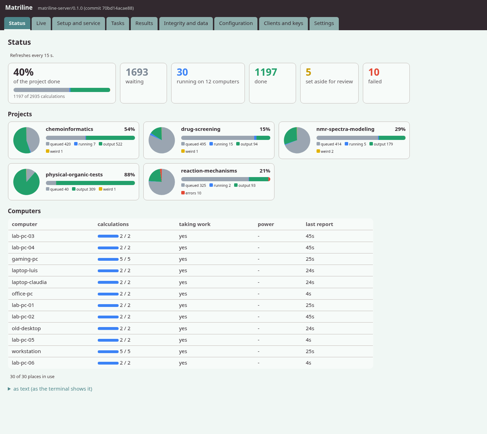
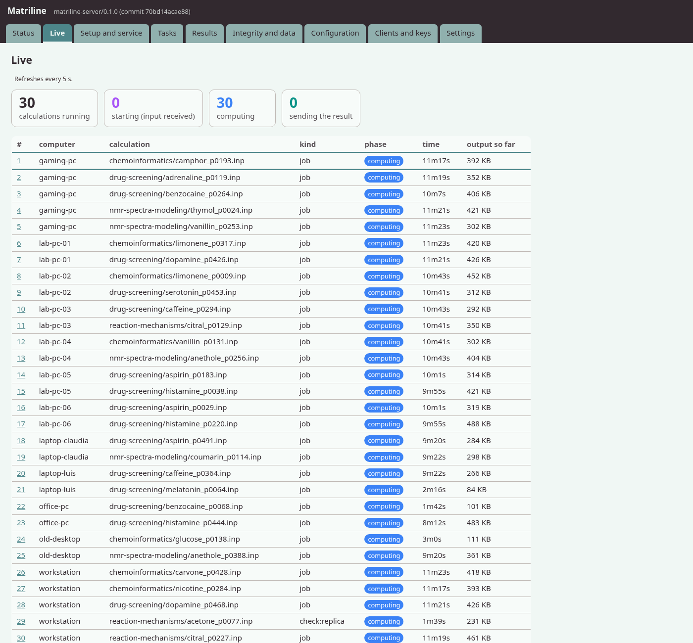
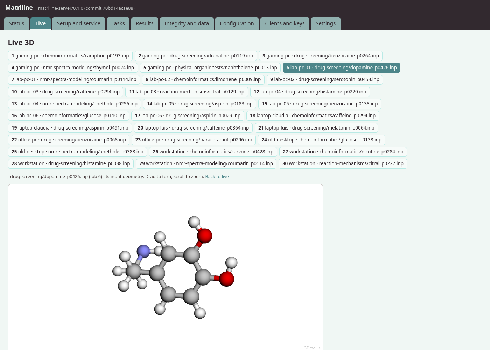
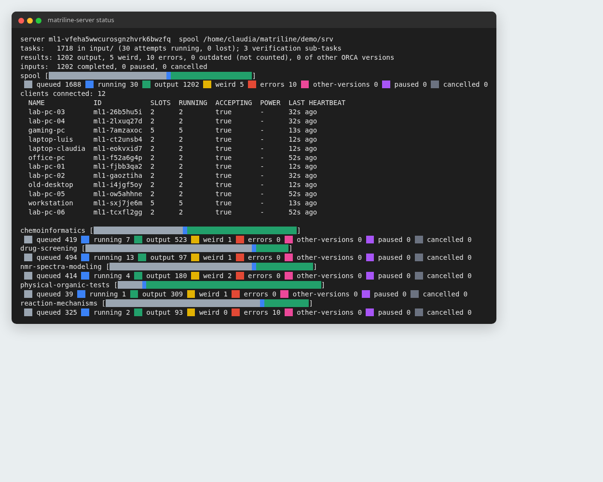
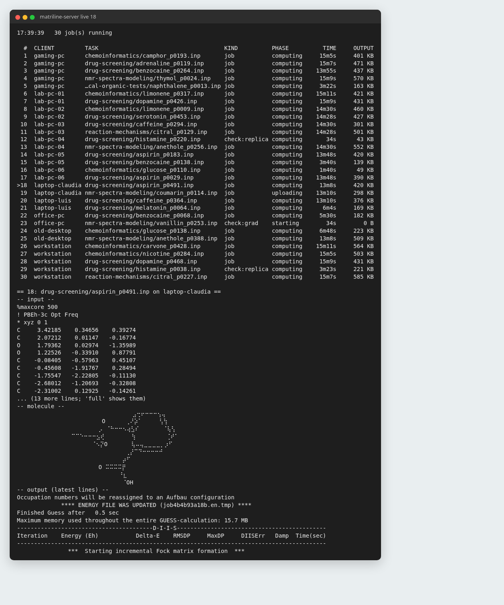

# Matriline

**Share the work of quantum-chemistry calculations among ordinary computers.**

Matriline lets a research group use the computers it already has (lab desktops, laptops,
the computers of colleagues who want to help) as if they were one bigger computer for
[ORCA](https://en.wikipedia.org/wiki/ORCA_(quantum_chemistry_program)) calculations.

## In plain words

- **Chemistry with computers.** Many properties of a molecule (its shape, its energy, how it
  absorbs light, whether a reaction can happen) can be predicted by solving the equations of
  quantum mechanics on a computer. This is
  [computational chemistry](https://en.wikipedia.org/wiki/Computational_chemistry); a common
  method is [density functional theory](https://en.wikipedia.org/wiki/Density_functional_theory).
- **ORCA** is a widely used program that does these calculations, free for academic use. One
  calculation takes from seconds to days, and a research project often needs hundreds or
  thousands of them.
- **The problem.** Groups without access to a computing cluster run them one after another
  on a few computers, which can take weeks.
- **What Matriline does.** One computer, the *server*, keeps the list of calculations. Every
  computer that lends its time, a *client*, asks the server for one calculation, runs ORCA,
  sends back the result and asks for the next. Results arrive in a folder, with the same
  names as the inputs. Computers can join, leave, sleep, change
  network or lose power: nothing is lost, the calculation goes back to the list. The idea
  is the one of [volunteer computing](https://en.wikipedia.org/wiki/Volunteer_computing),
  for the size of a research group.
- **Results you can trust.** A computer could be faulty, or someone could send invented
  results. Matriline checks: it repeats parts of some calculations on another computer,
  slips in test calculations whose answer it already knows, compares the numbers, and keeps
  a record that cannot be altered without it being noticed. Suspicious results are set
  aside for a person to look at. How this was tested: [docs/SECURITY_TESTS.md](docs/SECURITY_TESTS.md).
- **Safe for the people who lend their computer.** ORCA runs locked in a *sandbox*: no
  internet, and it can only write in its own work folder. The owner can pause it at any
  moment, and it can pause by itself on battery, when the computer is hot or outside chosen
  hours.
- **Where it works.** Server: Linux or Windows. Helpers: Linux, Windows 10 and 11, macOS.
  Helpers work on different networks with internet access; the server needs a network with
  a public IP address that lets you open (forward) at least one TCP port to it
  ([what port forwarding is](https://en.wikipedia.org/wiki/Port_forwarding); INSTALL.md
  section 3 says how). In English, Spanish, French and Portuguese; Arabic is a machine
  translation, not yet reviewed.

## What it looks like

*The whole project at a glance: how much is done, what is waiting, running, set aside for a
person to check or failed; one card per project folder and the computers at work.*

*What every computer is calculating right now: starting, computing, or sending its result.*

*The molecule of any running calculation, in 3D in your web browser (here melatonin).*

*The same overview in a terminal, with one bar per project.*

*In a terminal: the calculations running, one of them in detail (its input, a drawing of
the molecule and ORCA's latest lines).*

These pictures come from a demonstration on one computer (lab/demo/), with well-known
public molecules.

## Is it for me?

- Yes, if you run many ORCA calculations and have several ordinary computers (or friends or
  colleagues willing to lend theirs), but no cluster or not enough time on one.
- On a **single computer**, use the sibling project [Nacomline](https://github.com/agaloya/nacomline):
  the same queue of calculations, with no network.

**ORCA's license applies to every use of Matriline**: academic or private use only, every
computer with its own licensed copy of ORCA, calculations for others only among ORCA
licensees, and ORCA cited in publications. Matriline does not include ORCA. Details:
[docs/ORCA_LICENSE.md](docs/ORCA_LICENSE.md).

## How to start

1. Install ORCA on each computer (download it from the
   [ORCA forum](https://orcaforum.kofo.mpg.de) after registering).
2. On the server: `matriline-server init`, then follow what it prints.
3. On each helper: `matriline-client init --credential <the file the server gives you>`.

Step by step, for every system: [INSTALL.md](INSTALL.md). After that, the server can be
used from a terminal menu (`console`) or from a page in your web browser (`web`).

## Learn more

| about | read |
|---|---|
| installing the server and the helpers | [INSTALL.md](INSTALL.md) |
| what each setting does | the configuration file itself (every option is explained in it) |
| why things are done the way they are | [docs/DECISIONS.md](docs/DECISIONS.md) |
| how server and helpers talk | [docs/PROTOCOL.md](docs/PROTOCOL.md) |
| attacks tried and their results | [docs/SECURITY_TESTS.md](docs/SECURITY_TESTS.md) |
| Windows and macOS specifics | [docs/PORTING.md](docs/PORTING.md) |
| reporting a security problem | [SECURITY.md](SECURITY.md) |
| software included from others (3Dmol.js) | [docs/THIRD_PARTY.md](docs/THIRD_PARTY.md) |

## Status

A working prototype, tested in a lab of virtual machines (Linux, Windows 10 and 11, every
command on each: lab/tests/cmdmatrix.sh, lab/README.md), on a Mac, and over the internet
(an overnight run of 200 calculations, no errors). A load test ran 120 helpers and 1200
calculations on one server, which used about 55 MB of memory.

## Details for administrators

### What it does

- **Queue in folders.** Inputs go to `input/` (sub-directories kept), results come back to
  `output/`, `weird/` (failed or disputed verification) or `errors/`, one result per task
  (replaced ones go to `outdated/`); a signed, hash-chained ledger records every file.
  `status`, `stats`, `review`, `accept`/`reject`, `redo`, `clean`, `check` (every task in
  one place, none lost), `events` (a short log of what happened).
- **Helpers anywhere.** Clients only dial out (home routers, public Wi-Fi, mobile hotspots), survive
  suspend, roaming, power cuts and server restarts, resume from checkpoints, and reconnect
  at once after a network change. Optional relay when no port can be opened.
- **Security.** TLS 1.3; one-time enrollment tickets, each computer creating its own device
  key (revocable; remote disable with cleanup, offline clients at their next connection,
  reversible with `clients enable`); automatic IP bans; disk reserve; ORCA runs
  in a sandbox (Linux: Landlock and namespaces, no network, no access outside the job;
  Windows: an AppContainer with no network, low integrity for multi-core jobs); reproducible
  release builds anyone can verify (`tools/release.sh --check`).
- **Result integrity.** Signed result manifests, ORCA build fingerprints, output consistency
  (echoed input, geometry, connectivity, stereochemistry incl. planar chirality), and active
  checks on other hosts: SCF re-check, gradient at the final geometry, Hessian probe,
  replicas and disguised canaries; second opinions, disputes, tie-breaks, late duplicates as
  free checks, reputation, automatic forgiving quarantine. Attack rounds and results:
  [docs/SECURITY_TESTS.md](docs/SECURITY_TESTS.md).
- **Scheduling.** One job per physical core by default; disk- and memory-aware admission
  (jobs that need more memory per core go to clients that lend it); temperature, battery and
  schedule limits on the client; optional learned scheduler (long jobs to fast hosts).
- **Three ways to drive it, one set of commands.** The command line; `console`, an
  interactive terminal with every command in numbered menus (asks for each argument, confirms
  risky ones); and `web`, a local web page (pie charts per sub-directory, a form per command)
  that only builds and runs the same command lines. Both warn when the running server is
  another build. A live view (`watch`, and `/live` on the web page) shows what every
  client computes: the input, a 2D drawing of the molecule (3D on the web page, with
  [3Dmol.js](https://3dmol.org), BSD license, built in), the latest output lines. The
  client has its own `console` too.
- **Signed updates (optional).** The server can look once a month for a new release and
  tell you or install it: clients first, between jobs, then the server; only if every
  client can, and only releases signed with the maintainer's key built into the programs;
  a new program is run once before it replaces anything, and one that does not run is never
  installed.
- **Two ORCA builds of one version** (x86-64 and arm64) verify each other (docs/PORTING.md).

### System requirements

Measured in the lab and on a real network (2026-10); figures per calculation are from a
campaign of ~320 ORCA 6.1.1 jobs (r2SCAN-3c Opt Freq, wB97M-V/def2-TZVPP and QZVPP single
points, phenols with up to 20 heavy atoms).

**Network (most important)**

| | server | client (helper) |
|---|---|---|
| connections | receives TCP on one port (default 44100) | only dials out to the server's port |
| behind a home router | **port forwarding** of that TCP port to the server, and the port open in the server's firewall; or a relay (below) | nothing to configure: works behind NAT, public Wi-Fi, mobile hotspots |
| address | a public IP or a DNS name; a changing IP is fine with a DNS name (clients look it up again after failed connections) | any; may change during a job (roaming is tolerated) |
| without any reachable port | `connection = relay`: both sides dial out to a `matriline-relay` on a machine with a public IP (a small VPS) | same |
| blocked networks | outbound TCP to an unusual port is needed; captive portals must be accepted first | |

Traffic is TLS 1.3 end to end (also through the relay). Idle clients exchange a heartbeat
every 60 s (a few hundred bytes). A dead connection is detected within ~90 s and the client
reconnects with backoff (1, 2, 4, 8 s ...); running jobs continue meanwhile.

**Bandwidth per calculation** (compressed transfer; results include the `.gbw` orbitals,
which dominate):

| job type | input | result returned |
|---|---|---|
| DFT optimization + frequencies, small molecule | < 10 kB | 2-4 MB |
| DFT single point, triple-zeta | < 10 kB | median 2.5 MB, max 47 MB |
| DFT single point, quadruple-zeta | < 10 kB | median 5.7 MB, max 120 MB |
| verification check on another host | ~the orbitals of the checked result (MB) | < 1 MB |

A home connection is plenty: 1 Mbit/s upload moves a typical result in under a minute.
Results can be trimmed with `results.include`/`exclude` (e.g. without `.gbw`, at the cost
of the cheap SCF re-check). `results.max_bytes` (default 2G) refuses larger results.

**Server**

- Linux (x86-64 or arm64); tested on Debian 13, CachyOS. No root needed.
- ORCA optional (a reference installation of the clients' version lets it fingerprint and
  check theirs; without it the server only warns).
- CPU and RAM: negligible (the lab server used ~25 MB of RAM with ~400 jobs).
- Disk: the inputs plus every result (sum of the column above; ~2 GB for the 320-job
  campaign), and `storage.min_free` that it always keeps free (default: 5 % of the disk, at most 5 GB).
- Always on while a campaign runs (it is the queue); a power cut is survived.

**Client (each computer that lends CPU)**

- Linux x86-64 or arm64 for the sandbox: kernel >= 5.13 with Landlock enabled, plus
  unprivileged user namespaces for network isolation (most current distributions). Without
  a working sandbox the client refuses to run ORCA unless `security.sandbox = false`.
  Windows 10 and 11: the sandbox is an AppContainer (no administrator needed). macOS (Apple
  Silicon and Intel): a sandbox-exec profile; one job per core (multi-core jobs are refused
  there: macOS cannot keep OpenMPI's sockets on this computer only, docs/PORTING.md).
- ORCA 6.1.1 installed (free for academic use; each user downloads it and accepts its
  license).
- RAM: 1 GB per job slot by default (`memory_per_core`); 15 % of the RAM stays free.
- Disk (scratch): < 1 GB per DFT job; correlated methods need several GB, and
  memory too: a DLPNO-CCSD(T)/cc-pVTZ radical needed more than 1 GB per core (`memory_per_core`). The client takes a job only if the free space fits.
- CPU: one job per physical core, all physical cores but one by default (`cores`);
  `smt = true` also uses the second hardware threads (+11 % throughput measured).

## The family

Three related projects by the same author, all under the same license:

- [Matriline](https://github.com/agaloya/matriline): ORCA jobs on many computers, with
  security and verification of results from machines you do not control.
- [Nacomline](https://github.com/agaloya/nacomline): ORCA jobs on one computer.
- [Catenaline](https://github.com/agaloya/catenaline): a proof of concept for any program
  that turns input files into output files, and for chains of programs.

## Acknowledgments

- Jorge García Ponce ([@jorgegponce](https://github.com/jorgegponce)) lent the Mac on which
  the macOS port was first built and tested.

License: AGPL-3.0 with an author-attribution additional term (see [docs/NOTICE](docs/NOTICE)).
Citation: see [CITATION.cff](CITATION.cff).

## Why "Matriline"

A *matriline* is the family group of orcas that travels and hunts together, each one doing
its part: like the computers of a Matriline project. The name also keeps the word "ORCA",
the program's trademark, out of the project's name.
